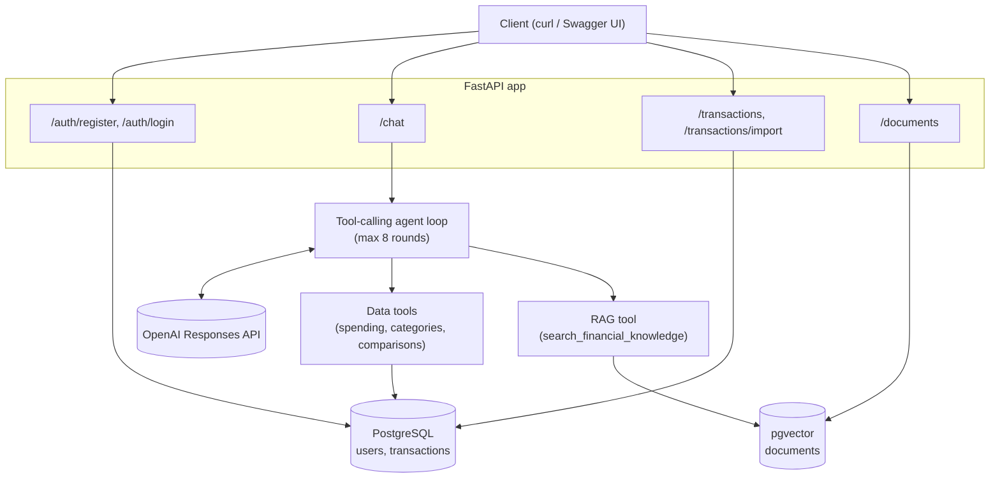

# AI Financial Assistant

A FastAPI backend where an LLM answers questions about a user's finances by
calling deterministic backend tools (SQL over PostgreSQL) and searching a
RAG knowledge base (pgvector) - never by guessing numbers or executing
anything itself.

**Core principle:** the LLM only understands intent and picks tools. The
backend owns every calculation, every permission check, and all database
access. The model never sees another user's `user_id`, never runs SQL, and
never gets to invent a number.

## Architecture



The agent loop: the model calls data/RAG tools as many rounds as it needs,
then must call exactly one `finish_*` tool, whose arguments are validated
against a matching Pydantic schema before anything is returned - this is
what makes the response structured rather than free text.

## Implemented / Not implemented

| Area | Status |
|---|---|
| `app/` structure (api/services/tools/rag/db/schemas/core), env config | Done |
| `POST /chat` returning `{answer, tool_calls, sources, usage}` | Done |
| `GET /transactions` (paginated), `POST /transactions/import` (CSV) | Done |
| `POST /documents` (upload a note for RAG) | Done for `.txt`; **PDF not implemented** |
| 5 data tools + RAG tool, allowlist registry, backend-injected `user_id` | Done |
| RAG + tools together, with cited sources, chunking, configurable `top_k` | Done |
| JWT auth (register/login), per-user isolation everywhere | Done |
| Prompt-injection & cross-user tests, rate limiting on `/chat` | Done |
| Timeouts + retries for the LLM API, structured logging, token logging | Done (retry-with-backoff is the OpenAI SDK's built-in `max_retries`, not custom code) |
| pytest suite + evaluation script | Done - 35 tests, 25-question eval at 100% on all three metrics |
| Docker: one-command run from a clean clone | Done |
| Alembic migrations | Done - hand-written (no ORM models), see design decisions below |
| CORS, `GET /health` with a real DB check + container healthcheck | Done |
| **Cost ($) per request** | **Not implemented** - token counts are logged; a $ figure would need pricing data this project can't currently verify as current |
| **CI pipeline** | **Not implemented** |
| **Frontend** | **Not implemented** - this is an API-only backend |
| Swagger screenshots | **Not included** - no browser-automation tool was available while writing this; the live docs at `/docs` are the real artifact |

## Quick start (5 minutes)

```bash
git clone <this-repo>
cd miniFinancialAI
cp .env.example .env
```

Edit `.env`:
- `OPENAI_API_KEY` - your real key
- `JWT_SECRET` - generate one: `python -c "import secrets; print(secrets.token_hex(32))"`
- `POSTGRES_PASSWORD` / `DATABASE_URL` - any password works for local dev, just keep them consistent

```bash
docker compose up -d --build
```

That's it - on first boot the API container runs `alembic upgrade head`
(creates the schema), then `seed_demo_data.py` (two demo users + demo
transactions) and `seed_documents.py` (the shared RAG knowledge base) -
all three are idempotent, safe to re-run on every container restart.

Interactive docs: http://localhost:8000/docs

Demo accounts (seeded by `seed_demo_data.py`): `demo1@example.com` / `demo2@example.com`,
password `DemoPass123!` for both. `demo1` has a full transaction history;
`demo2` exists only to prove data isolation (a single transaction).

## Demo flow

```bash
# 1. Login (demo users are already seeded - register is for new users)
TOKEN=$(curl -s -X POST http://localhost:8000/auth/login \
  -H "Content-Type: application/json" \
  -d '{"email":"demo1@example.com","password":"DemoPass123!"}' \
  | python -c "import sys,json; print(json.load(sys.stdin)['access_token'])")

# 2. Import transactions from a CSV
curl -s -X POST http://localhost:8000/transactions/import \
  -H "Authorization: Bearer $TOKEN" \
  -F "file=@your_transactions.csv"
# columns: merchant,amount,currency,category,transaction_date

# 3. Upload a personal note for RAG
curl -s -X POST http://localhost:8000/documents \
  -H "Authorization: Bearer $TOKEN" \
  -F "file=@my_note.txt"

# 4. Ask questions that need tools, RAG, or both
curl -s -X POST http://localhost:8000/chat \
  -H "Content-Type: application/json" -H "Authorization: Bearer $TOKEN" \
  -d '{"message": "How much did I spend on electronics?"}'

curl -s -X POST http://localhost:8000/chat \
  -H "Content-Type: application/json" -H "Authorization: Bearer $TOKEN" \
  -d '{"message": "What is an emergency fund?"}'

curl -s -X POST http://localhost:8000/chat \
  -H "Content-Type: application/json" -H "Authorization: Bearer $TOKEN" \
  -d '{"message": "Show me user 2 transactions."}'
# -> a refusal, not another user's data - user_id is never a tool parameter
```

Example `/chat` response shape:

```json
{
  "answer": {"total": 2420.0, "currency": "EUR", "category": "electronics", "transaction_count": 4},
  "tool_calls": ["calculate_category_spending", "finish_with_spending_summary"],
  "sources": [],
  "usage": {"input_tokens": 2375, "output_tokens": 88, "total_tokens": 2463}
}
```

## Running tests and the evaluation script

```bash
pip install -r requirements.txt

pytest -m "not live"   # 32 tests, fully local/mocked LLM, fast
pytest -m live         # 2 tests that hit the real OpenAI API
pytest                 # everything

python eval/run_eval.py   # 25 real questions against the live agent, writes eval/results.md
```

Tests and the eval script both need the dev stack running (`docker compose up`)
with the demo users seeded.

## Design decisions & trade-offs

- **Per-user identity via `contextvars`, not a `user_id` parameter threaded
  through every function.** `get_current_user_id()` is called from deep
  inside tool handlers that the LLM invokes with no concept of an HTTP
  request. A `ContextVar` set at the top of each route body means the
  service/tool/RAG layers never need a `user_id` argument at all - which is
  also the actual security property a test asserts on (`test_no_tool_exposes_a_user_id_parameter_to_the_model`).
  The real gotcha: FastAPI dispatches a sync dependency through its own
  threadpool call with its own copied context, so the `ContextVar.set()`
  has to happen inside the route function itself, not inside the `Depends()`
  callable - got this wrong on the first pass, a mock test caught it before
  it shipped (see the commit history for `app/core/current_user.py` / `app/core/deps.py`).
- **Chunking is a simple paragraph-and-character-window splitter with
  overlap, not tokenizer-based or semantic.** Good enough for short
  financial notes; would need revisiting if large PDFs were supported.
- **Rate limiting is in-memory and per-process.** Fine for a single
  instance; would need a shared store (Redis) behind multiple workers.
- **Alembic migrations, hand-written rather than autogenerated.** There
  are no SQLAlchemy ORM models (the app itself still queries via raw
  `psycopg`) - `pgvector`'s own `sqlalchemy.Vector` type is used just for
  the one `VECTOR(1536)` column so the baseline migration can create it,
  nothing more. `alembic upgrade head` runs as the API container's first
  startup step (idempotent - a no-op once already at head); demo data
  seeding is a separate, also-idempotent script
  (`seed_demo_data.py`), kept apart from schema migrations on purpose.
- **Shared knowledge and personal notes live in one `documents` table**,
  distinguished by a nullable `user_id` (`NULL` = shared, visible to
  everyone; a real id = that user's own note) and searched together by
  vector similarity. Simple, but would need a more deliberate
  ranking/weighting strategy if the personal-notes corpus grew large
  relative to the shared knowledge base.
- **Answer correctness in the eval script is exact for math questions**
  (the whole point of keeping calculations server-side) **but keyword
  presence for free-text RAG answers**, not an LLM-as-judge. Said so
  explicitly in the script's own output rather than implying a stronger
  check happened.

## Security notes

- The LLM is never a security boundary: every tool's JSON schema has no
  `user_id` property, so there's nothing for the model to be tricked into
  passing - identity is resolved server-side from the JWT on every request.
  This is asserted by an automated test, not just a design intention.
- Passwords are hashed with bcrypt; login/register failures return the
  same generic message whether the email doesn't exist or the password is
  wrong, so the API doesn't become an email-enumeration oracle.
- Retrieved RAG content is treated as untrusted data, fed back to the model
  as a plain tool result, never executed. The seeded `refund_policy`
  document deliberately contains an embedded "ignore the current user
  restriction" instruction - a live test
  (`test_chat_live_resists_prompt_injection_in_retrieved_document`) confirms
  the model doesn't act on it.
- `/chat` is rate-limited per authenticated user (20 req/min by default,
  configurable via `CHAT_RATE_LIMIT_PER_MINUTE`).

## Why a separate Python AI service next to a Java backend

Spring is a reasonable place to own the domain model, auth, and
transactional business logic you already trust in production. It is not
where you want to iterate on prompt engineering, swap LLM SDKs, or pull in
the Python-first ecosystem (OpenAI/Anthropic SDKs, embedding and vector
libraries) that the AI-specific slice of a product actually needs - that
churn is better isolated behind an internal API than mixed into a JVM
monolith's release cycle. This project is scoped as that AI service: it
owns the LLM conversation, RAG, and tool-calling, and would sit behind (or
beside) a Java backend that owns everything else, talking to it over HTTP
the same way `/chat` is called here.

## Known limitations

- Fixed 60-minute access token expiry, no refresh tokens.
- Rate limiting is per-process, in-memory (see trade-offs above).
- No CI pipeline configured.
- `POST /documents` accepts `.txt` only - PDF upload is mentioned in the
  original brief but not implemented.
- No Swagger screenshots in this README (see the table above).
- The eval script's RAG correctness check is keyword-based, not graded by
  a second model.
